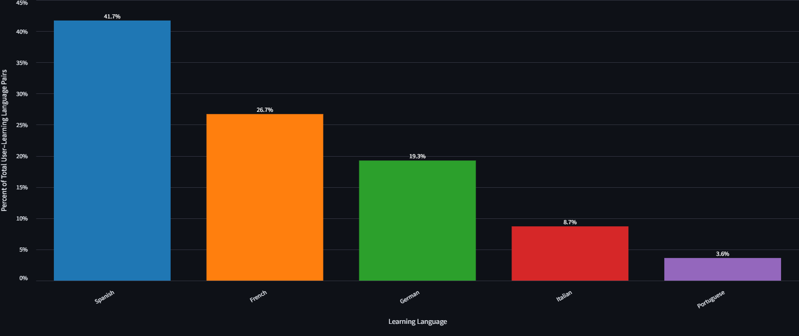
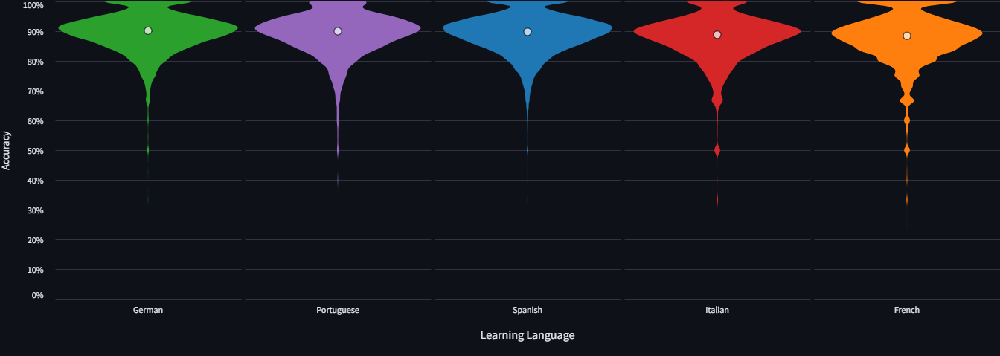
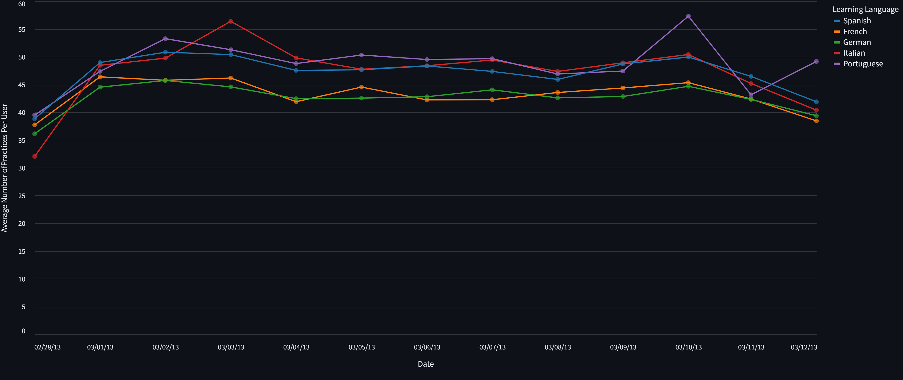

# Duolingo Data Insights
_End-to-end batch data engineering project for the DataTalksClub Data Engineering Zoomcamp_

---

## 🚀 Why This Project Matters
Duolingo’s spaced repetition dataset is widely used in research but not easily accessible for practical analytics.

This project transforms a **research dataset into a production-style analytics platform**, enabling:
- exploration of language learning behavior at scale
- understanding of accuracy differences across languages
- tracking of user engagement over time

It demonstrates how to turn raw data into **actionable insights using modern data engineering tools**.

---

## 📊 Overview
This project builds an end-to-end batch data pipeline on Google Cloud.

Pipeline flow:
- ingest raw data into **GCS**
- load into **BigQuery**
- transform using **dbt**
- serve via **Streamlit dashboard**

---

## 🏗️ Architecture Diagram
```
        +----------------------+
        |  Duolingo Dataset    |
        +----------+-----------+
                   |
                   v
        +----------------------+
        |   GCS (Data Lake)    |
        +----------+-----------+
                   |
                   v
        +----------------------+
        | BigQuery (Warehouse) |
        +----------+-----------+
                   |
                   v
        +----------------------+
        |  dbt Transformations |
        +----------+-----------+
                   |
                   v
        +----------------------+
        | Streamlit Dashboard  |
        +----------------------+
```

---

## 🧱 Data Model (dbt Lineage)
```
            raw_external_table
                    |
                    v
             staging_models
                    |
                    v
               mart_models
                    |
                    v
             dashboard_tables
```

- **Staging:** cleaning + filtering (ui_language = 'en')
- **Marts:** aggregations for dashboard use
- **Final layer:** optimized for analytics queries

---

## 🛠️ Technologies Used
- **Cloud:** Google Cloud (GCS, BigQuery)
- **Orchestration:** Kestra
- **Transformations:** dbt
- **Visualization:** Streamlit
- **Containerization:** Docker Compose

---

## ⚙️ Pipeline Steps
1. Provision GCS + BigQuery  
2. Upload dataset to GCS  
3. Create external + native tables  
4. Transform data with dbt  
5. Serve via Streamlit  

---

## 🗄️ Data Warehouse Design
- **Partitioning:** `event_dt`
- **Clustering:** `learning_language`, `ui_language`

Optimized for:
- time-based queries
- language-level aggregations

---

## 📈 Dashboard

### Users by Learning Language

Visualizes the distribution of languages being learned


### Accuracy by Learning Language

Visualizes the overall accuracy by learning language


### Daily Practices per User by Learning Language: Visualizes the average number of daily practices per user by laerning language


---

## 📁 Repository Structure
```
Duolingo-Data-Insights/
├── dbt/
├── kestra/
├── streamlit_app/
├── images/
├── docker-compose.yml
├── template.env
└── README.md
```

---

## Running this Project

To run the Duolingo Data Insights Project, follow the sections below.

### Google Cloud Initialization

1. Navigate to [Google Cloud](https://console.cloud.google.com/)
1. Create a new Google Cloud Project and take note of the project id
1. Go to IAM & Admin then click in Service Accounts 
1. Create a new Service Account with roles: BigQuery Admin, Compute Admin, and Storage Admin
1. Click the elipses under Actions and click the Manage Keys option
1. Click the Add key button, then click Create new key, then select JSON
1. The JSON will go to your downloads. Save the file in a safe place. Do NOT show it to anyone

### Set up Secrets and Environment Variables

1. Git clone this repository into a folder called "Duolingo-Data-Insights"
1. Create a secrets folder within the "Duolingo-Data-Insights" folder and add the service account key JSON file to the secrets folder (secrets/*.json is in .gitignore)
1. Create a **.env** file based on [template.env](template.env)

### Kestra and Streamlit

Kestra is the tool that runs the end to end pipeline process, and Streamlit visualizes this project's analytics in a dashboard.

1. Update the following variables in [gcp_kv.yml](kestra/flows/duolingo.gcp_kv.yml)
    - gcp_project_id
    - gcp_location
    - gcp_bucket_name
    - gcp_dataset
1. Open VS Code (or your preferred editor) and open a new Git Bash terminal
1. cd into the "Duolingo-Data-Insights" folder (the folder you created when you git cloned this repository)
1. Run `docker compose up` to start up kestra and the streamlit app that will show a populated dashboard once the kestra flows have been run
1. Open Kestra by going to http://127.0.0.1:8080/ui/ and login with the credentials defined in [docker-compose.yml](docker-compose.yml) under services -> kestra -> environment -> KESTRA_CONFIGURATION -> kestra -> server -> basicAuth
    - username: admin@kestra.io
    - password: Admin1234
1. Navigate to flows, then click on the text of the `pipeline_master`
1. Run the **[Master Pipeline](kestra/flows/duolingo.pipeline_master.yml)** flow in kestra by clicking the **Execute** button in the top right corner. This will start running all the kestra flows in the following order:
    1. Create key, value pairs for Google Cloud with [duolingo.gcp_kv.yml](kestra/flows/duolingo.gcp_kv.yml)
    1. Create GCS buckets and dataset with [duolingo.gcp_setup.yml](kestra/flows/duolingo.gcp_setup.yml)
    1. Download and ingest the gzipped data into the GCS bucket with [duolingo.ingestion.yml](kestra/flows/duolingo.ingestion.yml)
    1. Create the external table, DDL for the main table, and populate the main table with [duolingo.table_creation.yml](kestra/flows/duolingo.table_creation.yml). Task `duolingo_table_ddl` handles partioning and clustering explained below
        1. partitioned by event_dt to optimize time-based analysis and reduce scan costs for trend queries in the dashboard
        1. clustered by learning_language because the dashboard groups metrics by learning language, so clustering improves aggregation and filtering performance for those visuals
        1. clustered by ui_language because this supports queries filtered by interface language
    1. Use DBT to transform the data into the relevant staging and marts tables to power the visuals in the streamlit app in [duolingo.dbt_transform.yml](kestra/flows/duolingo.dbt_transform.yml)

### Streamlit Dashboard App

1. Ensure docker compose is still running
1. Once the [Master Pipeline](kestra/flows/duolingo.pipeline_master.yml) has run successfully at least once, launch http://localhost:8501/ to open the Streamlit Dashboard App